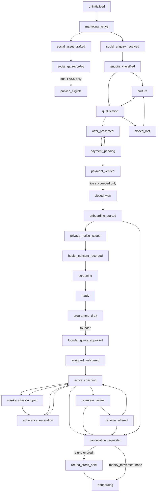
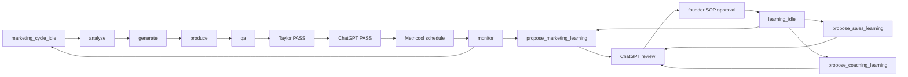

# Lifecycle

Machine-readable source: `model/lifecycle.json`. Every transition includes `id`, `from`, `to`, `event`, `owner`, `requiredEvidence`, `systemOfRecord`, `automatedAction`, `guard`, `stopCondition`, `retryPolicy`, `nextTrigger`, `founderGate`, and `idempotencyKey`.

## End-to-end

Social publication is not a commercial-state shortcut. First-client go-live stays on the founder gate.

Parallel tracks (do not consume commercial state):

